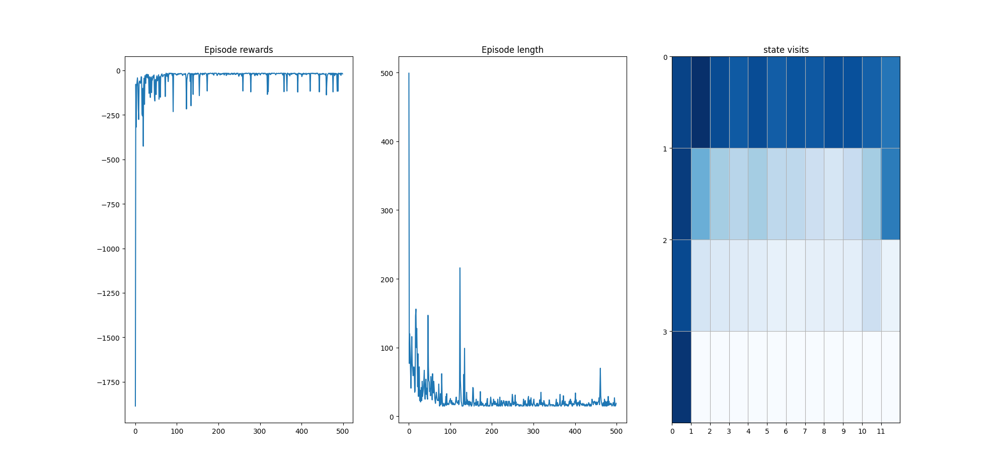
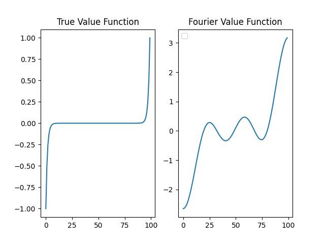
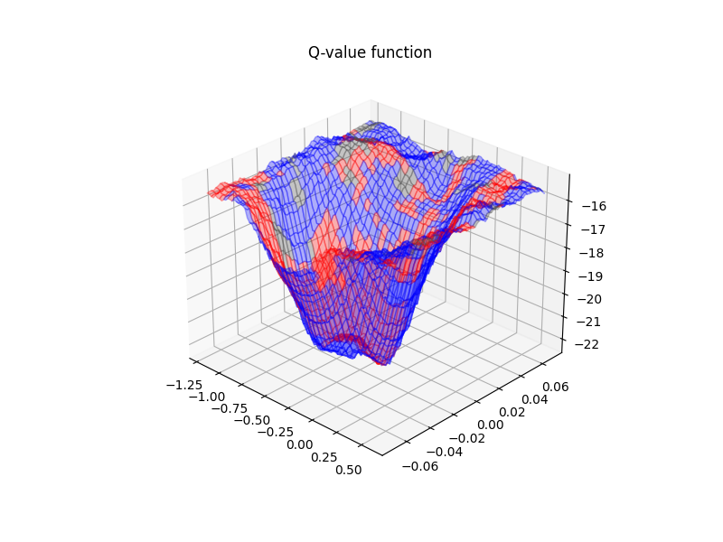

# RL from scratch

This repo contains my from-scratch implementations of some common RL algorithms.

The main goal is to do a deep dive by implementing, to go beyond the theoretical
understanding.

Therefore it is structured with simplicity in mind, with each algorithm being
self contained and in a single file aand with as little abstraction as possible.

<!--ts-->
* [RL from scratch](#rl-from-scratch)
   * [Install](#install)
   * [Run](#run)
      * [Algorithms](#algorithms)
      * [Extras](#extras)
   * [References and Implementations](#references-and-implementations)

<!-- Created by https://github.com/ekalinin/github-markdown-toc -->
<!-- Added by: ubuntu, at: Thu Dec 29 19:47:33 UTC 2022 -->

<!--te-->


## Install

1. Install mesa glx drivers:

```bash
sudo apt-get install -y mesa-utils and libgl1-mesa-glx
sudo apt-get install mesa-common-dev libgl1-mesa-dev libglu1-mesa-dev
```

2. Create a virtual env with `python>=3.8`

```bash
python3.8 -m venv .venv
source .venv/bin/activate
```

3. Then install with:

```bash
pip install -r requirements.txt
pip install -r requirements-dev.txt
```

## Run

> If at run time, when running an environtment with `render_mode="human"` you see:
> `libGL error: MESA-LOADER`, you might need to run like:
> ```bash
> MESA_LOADER_DRIVER_OVERRIDE=i965 python <your-script.py>
> ```
> For more info check [this blogpost](https://devcodetutorial.com/faq/libgl-error-failed-to-load-drivers-iris-and-swrast-in-ubuntu-20-04)


### Algorithms


<details>
  <summary>Tabular SARSA</summary>

  Episodic **on-policy** TD(0) learning control algorithm with epsilon-greedy policy


   **Valid environments:**

   - [CliffWalking-v0](https://gymnasium.farama.org/environments/toy_text/cliff_walking/)
   - [FrozenLake-v1](https://gymnasium.farama.org/environments/toy_text/frozen_lake/#frozen-lake)

   **Examples:**

   ```bash
   # SARSA on Cliff World
   python -m algorithms.tabular.sarsa -e CliffWalking-v0

   # Output (policy):
   ┌───────┬───────┬───────┬───────┬───────┬───────┬───────┬───────┬───────┬───────┬───────┬──────┐
   │ right │ right │ right │ right │ right │ right │ right │ right │ right │ right │ right │ down │
   ├───────┼───────┼───────┼───────┼───────┼───────┼───────┼───────┼───────┼───────┼───────┼──────┤
   │ up    │ up    │ right │ right │ up    │ up    │ right │ right │ up    │ right │ up    │ down │
   ├───────┼───────┼───────┼───────┼───────┼───────┼───────┼───────┼───────┼───────┼───────┼──────┤
   │ up    │ up    │ right │ right │ up    │ up    │ left  │ left  │ left  │ right │ right │ down │
   ├───────┼───────┼───────┼───────┼───────┼───────┼───────┼───────┼───────┼───────┼───────┼──────┤
   │ up    │ x     │ x     │ x     │ x     │ x     │ x     │ x     │ x     │ x     │ x     │ x    │
   └───────┴───────┴───────┴───────┴───────┴───────┴───────┴───────┴───────┴───────┴───────┴──────┘
   ```

   Also plots each epidoe `rewards`, `length` and the number of each `state's visits`:

   

   ```bash
   # SARSA on FrozenLake
   python -m algorithms.tabular.sarsa -e FrozenLake-v1 -ep 0.5 -nep 5000

   # Output (policy)
   ┌───────┬───────┬───────┬────┐
   │ right │ right │ down  │ up │
   ├───────┼───────┼───────┼────┤
   │ right │ x     │ down  │ x  │
   ├───────┼───────┼───────┼────┤
   │ right │ right │ down  │ x  │
   ├───────┼───────┼───────┼────┤
   │ x     │ right │ right │ x  │
   └───────┴───────┴───────┴────┘
   ```
</details>


<details>
  <summary>Tabular Q-learning</summary>

   Episodic **off-policy** TD(0) learning control algorithm with epsilon-greedy policy

   **Valid environments:**

   - [CliffWalking-v0](https://gymnasium.farama.org/environments/toy_text/cliff_walking/)
   - [FrozenLake-v1](https://gymnasium.farama.org/environments/toy_text/frozen_lake/#frozen-lake)


   **Examples:**

   ```bash
   # Q-learning on Frozen lake
   python -m algorithms.tabular.q_learning -e FrozenLake-v1 -ep 0.5 -nep 5000

   # Output (policy):
   ┌───────┬───────┬───────┬──────┐
   │ down  │ right │ down  │ left │
   ├───────┼───────┼───────┼──────┤
   │ down  │ x     │ down  │ x    │
   ├───────┼───────┼───────┼──────┤
   │ right │ down  │ down  │ x    │
   ├───────┼───────┼───────┼──────┤
   │ x     │ right │ right │ x    │
   └───────┴───────┴───────┴──────┘
   ```
</details>


<details>
  <summary>first-visit Monte Carlo</summary>

  Monte Carlo Conrol with epsilon-greedy policies

   **Valid environments:**

   - [Blackjack-v1](https://gymnasium.farama.org/environments/toy_text/blackjack/#blackjack)


   **Examples:**

   ```bash
   # first-visit MC on Blackjack
   python -m algorithms.tabular.first_visit_MC -e Blackjack-v1 -ep 0.1 -nep 500000
   ```
</details>

<details>
  <summary>Fourier Basis linear function aproximation</summary>

  Fourier Basis linear fucntion aproximation to estimate the value-function
  in the N-step random walk environent.

   **Valid environments:**

   - [random_1D_walk](helpers/environment/random_1D_walk.py)


   **Examples:**

   ```bash
   python -m algorithms.aproximate.fourier_value_function_random_walk --env-size 1000
   ```

   

</details>

<details>
  <summary>n-step Semi-gradient SARSA</summary>

  Episodic **on-policy** TD(0) learning control algorithm with epsilon-greedy
  policy and function approximation.

  Uses a `n-step=4` and `tiling` with 8 tiles.

   **Valid environments:**

   - [MountainCar-v0](https://gymnasium.farama.org/environments/classic_control/mountain_car/)


   **Examples:**

   ```bash
   # semi-gradient SARSA with neural netowrk function aprox. and tiling
   python -m algorithms.aproximate.n_step_semi_gradient_sarsa_nn \
      -e MountainCar-v0 \
      --explore-probability 0.1 \
      -ne 5000 \
      -mes 200 \
      -st 1e-3
   ```

   The resulting value function. Blue indicates move right, red move left, gray
   do not move:

   

</details>

<details>
  <summary>Expected SARSA</summary>

  `Expected SARSA` is a unification of `SARSA` and `Q-learning`.
  This algorithm can be both _on-policy_ or _off-policy_
  (by having a behaviour and a target policy).
  Works both _episodic_ and _continuing_ tasks and can be implmemented in a
  _tabular_ form or with approximation like the _semi-gradient_ version.

  When used along with a epsilon-greedy behaviour policy and with a greedy target
  policy, then becomes equivalent to `Q-learning`.
  if the

  > TBD

</details>

<details>
  <summary>SARSA(lambda) - eligibility traces</summary>


  > TBD

</details>


### Extras

The [extras](extras) directory contains additional self-contained experiments and exercises in easy to run jupyter notebooks. 


## References and Implementations

 - [**Reinforcement Learning:An Introduction - Richard S. Sutton and Andrew G. Barto**](http://incompleteideas.net/book/bookdraft2018jan1.pdf)
 - [michaeloneill RL-tutorial](https://michaeloneill.github.io/RL-tutorial.html)
 - [syyxtl/Reinforcement_learning](https://github.com/syyxtl/Reinforcement_learning/)
 - [dennybritz/reinforcement-learning](https://github.com/dennybritz/reinforcement-learning)
 - [self-supervisor/SARSA-Mountain-Car-Sutton-and-Barto](https://github.com/self-supervisor/SARSA-Mountain-Car-Sutton-and-Barto)
